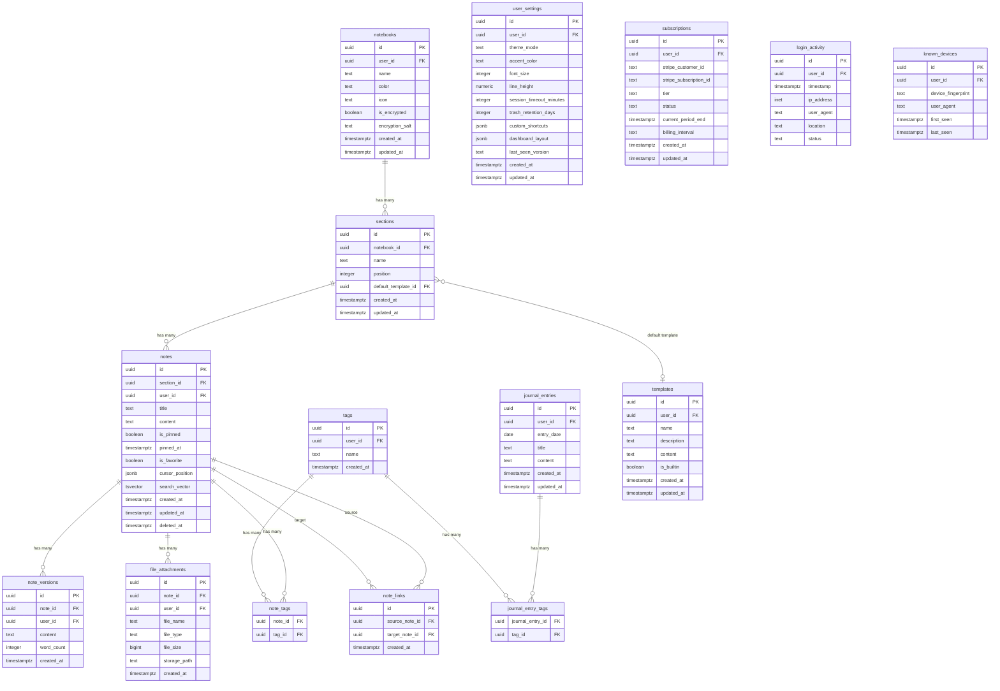

# simpl-markdown — Database Schema & ERD

**Author:** Komil
**Date:** 2026-04-17
**Source:** Derived from PRD (110 FRs), Architecture (17 decisions), and Epics (77 stories)

---

## Entity-Relationship Diagram



---

## Table Documentation

### 1. `notebooks`

**Purpose:** Top-level content containers. Each user has multiple notebooks.
**Migration:** `00001_initial_schema.sql`
**Phase:** MVP (Epic 1, Story 1.4)

| Column | Type | Constraints | Description |
|--------|------|-------------|-------------|
| `id` | `uuid` | PK, default `gen_random_uuid()` | Unique identifier |
| `user_id` | `uuid` | FK → `auth.users(id)`, NOT NULL | Owner |
| `name` | `text` | NOT NULL | Notebook display name |
| `color` | `text` | DEFAULT `'blue'` | Color from curated palette (FR10) |
| `icon` | `text` | DEFAULT `'notebook'` | Icon name from built-in library (FR10) |
| `is_encrypted` | `boolean` | DEFAULT `false` | E2E encryption enabled (FR73, Phase 3) |
| `encryption_salt` | `text` | NULLABLE | Per-notebook encryption salt (Phase 3) |
| `created_at` | `timestamptz` | DEFAULT `now()` | Creation timestamp (FR25) |
| `updated_at` | `timestamptz` | DEFAULT `now()` | Last modified (FR25) |

**Indexes:** `idx_notebooks_user_id` on `user_id`
**RLS:** `notebooks_select_own`, `notebooks_insert_own`, `notebooks_update_own`, `notebooks_delete_own` — all using `is_owner(user_id)`

---

### 2. `sections`

**Purpose:** Subdivisions within notebooks. Each notebook has multiple sections.
**Migration:** `00001_initial_schema.sql`
**Phase:** MVP (Epic 1, Story 1.4)

| Column | Type | Constraints | Description |
|--------|------|-------------|-------------|
| `id` | `uuid` | PK, default `gen_random_uuid()` | Unique identifier |
| `notebook_id` | `uuid` | FK → `notebooks(id)` ON DELETE CASCADE, NOT NULL | Parent notebook |
| `name` | `text` | NOT NULL | Section display name |
| `position` | `integer` | DEFAULT `0` | Sort order within notebook |
| `default_template_id` | `uuid` | FK → `templates(id)` ON DELETE SET NULL, NULLABLE | Auto-applied template (FR58) |
| `created_at` | `timestamptz` | DEFAULT `now()` | Creation timestamp |
| `updated_at` | `timestamptz` | DEFAULT `now()` | Last modified |

**Indexes:** `idx_sections_notebook_id` on `notebook_id`
**RLS:** Inherited via notebook ownership — join to `notebooks` and check `is_owner(notebooks.user_id)`

---

### 3. `notes`

**Purpose:** Individual documents. The core content entity. Each section has multiple notes.
**Migration:** `00001_initial_schema.sql` (base), `00003_search.sql` (search_vector), `00004_trash.sql` (deleted_at)
**Phase:** MVP (Epic 1, Story 1.4)

| Column | Type | Constraints | Description |
|--------|------|-------------|-------------|
| `id` | `uuid` | PK, default `gen_random_uuid()` | Unique identifier |
| `section_id` | `uuid` | FK → `sections(id)` ON DELETE CASCADE, NOT NULL | Parent section |
| `user_id` | `uuid` | FK → `auth.users(id)`, NOT NULL | Owner (denormalized for fast RLS) |
| `title` | `text` | DEFAULT `''` | Note title |
| `content` | `text` | DEFAULT `''` | Markdown content body |
| `is_pinned` | `boolean` | DEFAULT `false` | Pinned to top of section (FR16) |
| `pinned_at` | `timestamptz` | NULLABLE | When pinned (for pin sort order) |
| `is_favorite` | `boolean` | DEFAULT `false` | Starred as favorite (FR17) |
| `cursor_position` | `jsonb` | NULLABLE | Last cursor position for persistence (FR46) |
| `search_vector` | `tsvector` | Auto-updated via trigger | Full-text search index (FR30) |
| `created_at` | `timestamptz` | DEFAULT `now()` | Creation timestamp (FR25) |
| `updated_at` | `timestamptz` | DEFAULT `now()` | Last modified (FR25) |
| `deleted_at` | `timestamptz` | NULLABLE | Soft delete timestamp (FR41). NULL = active. Non-null = trashed. |

**Indexes:**
- `idx_notes_user_id` on `user_id`
- `idx_notes_section_id` on `section_id`
- `idx_notes_search_vector` GIN index on `search_vector`
- `idx_notes_deleted_at` on `deleted_at` (for trash queries)
- `idx_notes_is_favorite` partial index WHERE `is_favorite = true`

**Trigger:** `trigger_update_search_vector` — auto-updates `search_vector` from `title || ' ' || content || ' ' || (joined tag names)` on INSERT/UPDATE

**RLS:** `notes_select_own`, `notes_insert_own`, `notes_update_own`, `notes_delete_own` — all using `is_owner(user_id)`

**Note on `user_id` denormalization:** `user_id` is stored directly on `notes` even though it could be derived via `sections → notebooks → user_id`. This avoids expensive joins in every RLS policy check and every query. The trade-off (slight redundancy) is worth the performance gain at scale (NFR-SC2: 100K notes per user).

---

### 4. `tags`

**Purpose:** User-defined labels for cross-notebook organization.
**Migration:** `00002_tags.sql`
**Phase:** MVP (Epic 3, Story 3.2)

| Column | Type | Constraints | Description |
|--------|------|-------------|-------------|
| `id` | `uuid` | PK, default `gen_random_uuid()` | Unique identifier |
| `user_id` | `uuid` | FK → `auth.users(id)`, NOT NULL | Owner |
| `name` | `text` | NOT NULL | Tag display name |
| `created_at` | `timestamptz` | DEFAULT `now()` | Creation timestamp |

**Indexes:** `idx_tags_user_id` on `user_id`; UNIQUE constraint on `(user_id, name)` — no duplicate tag names per user
**RLS:** `tags_select_own`, `tags_insert_own`, `tags_update_own`, `tags_delete_own`

---

### 5. `note_tags`

**Purpose:** Junction table linking notes to tags (many-to-many).
**Migration:** `00002_tags.sql`
**Phase:** MVP (Epic 3, Story 3.2)

| Column | Type | Constraints | Description |
|--------|------|-------------|-------------|
| `note_id` | `uuid` | FK → `notes(id)` ON DELETE CASCADE, NOT NULL | Tagged note |
| `tag_id` | `uuid` | FK → `tags(id)` ON DELETE CASCADE, NOT NULL | Applied tag |

**Constraints:** PRIMARY KEY on `(note_id, tag_id)` — each tag applied once per note
**RLS:** Inherited via note ownership — join to `notes` and check `is_owner(notes.user_id)`

---

### 6. `journal_entries`

**Purpose:** Daily journal entries, separate from the notebook hierarchy.
**Migration:** `00006_journal.sql`
**Phase:** Growth (Epic 6, Story 6.1)

| Column | Type | Constraints | Description |
|--------|------|-------------|-------------|
| `id` | `uuid` | PK, default `gen_random_uuid()` | Unique identifier |
| `user_id` | `uuid` | FK → `auth.users(id)`, NOT NULL | Owner |
| `entry_date` | `date` | NOT NULL | Calendar date for this entry |
| `title` | `text` | NOT NULL | Auto-generated from date (e.g., "Thursday, April 17, 2026") |
| `content` | `text` | DEFAULT `''` | Markdown content body |
| `created_at` | `timestamptz` | DEFAULT `now()` | Creation timestamp |
| `updated_at` | `timestamptz` | DEFAULT `now()` | Last modified |

**Constraints:** UNIQUE on `(user_id, entry_date)` — one entry per user per day
**Indexes:** `idx_journal_entries_user_id_date` on `(user_id, entry_date)`
**RLS:** `journal_entries_select_own`, `journal_entries_insert_own`, `journal_entries_update_own`, `journal_entries_delete_own`

---

### 7. `journal_entry_tags`

**Purpose:** Junction table linking journal entries to tags (many-to-many). Enables journal entries to appear in global tag views.
**Migration:** `00006_journal.sql`
**Phase:** Growth (Epic 6, Story 6.4)

| Column | Type | Constraints | Description |
|--------|------|-------------|-------------|
| `journal_entry_id` | `uuid` | FK → `journal_entries(id)` ON DELETE CASCADE, NOT NULL | Tagged entry |
| `tag_id` | `uuid` | FK → `tags(id)` ON DELETE CASCADE, NOT NULL | Applied tag |

**Constraints:** PRIMARY KEY on `(journal_entry_id, tag_id)`
**RLS:** Inherited via journal entry ownership

---

### 8. `note_versions`

**Purpose:** Full content snapshots for version history and diff tracking.
**Migration:** `00009_note_versions.sql`
**Phase:** Growth (Epic 5, Story 5.1)

| Column | Type | Constraints | Description |
|--------|------|-------------|-------------|
| `id` | `uuid` | PK, default `gen_random_uuid()` | Unique identifier |
| `note_id` | `uuid` | FK → `notes(id)` ON DELETE CASCADE, NOT NULL | Parent note |
| `user_id` | `uuid` | FK → `auth.users(id)`, NOT NULL | Owner (denormalized for RLS) |
| `content` | `text` | NOT NULL | Full content snapshot at this point in time |
| `word_count` | `integer` | NOT NULL | Word count at this version |
| `created_at` | `timestamptz` | DEFAULT `now()` | Version creation timestamp |

**Indexes:** `idx_note_versions_note_id` on `note_id`; `idx_note_versions_created_at` on `(note_id, created_at DESC)` for newest-first queries
**RLS:** `note_versions_select_own` using `is_owner(user_id)`
**Note:** New version row created on each auto-save. Deduplicated — skip if content unchanged from previous version.

---

### 9. `templates`

**Purpose:** Reusable note templates (built-in and custom).
**Migration:** `00010_templates.sql`
**Phase:** Growth (Epic 7, Story 7.1)

| Column | Type | Constraints | Description |
|--------|------|-------------|-------------|
| `id` | `uuid` | PK, default `gen_random_uuid()` | Unique identifier |
| `user_id` | `uuid` | FK → `auth.users(id)`, NULLABLE | Owner. NULL = built-in template. |
| `name` | `text` | NOT NULL | Template display name |
| `description` | `text` | DEFAULT `''` | Brief description for picker |
| `content` | `text` | NOT NULL | Template body with variable tokens |
| `is_builtin` | `boolean` | DEFAULT `false` | True for system-provided templates |
| `created_at` | `timestamptz` | DEFAULT `now()` | Creation timestamp |
| `updated_at` | `timestamptz` | DEFAULT `now()` | Last modified |

**RLS:** All users can SELECT where `is_builtin = true`. Users can CRUD where `is_owner(user_id)`. Built-in templates are INSERT/UPDATE/DELETE restricted to service role only.
**Seed:** 12 built-in templates seeded via `supabase/seed.sql`

---

### 10. `file_attachments`

**Purpose:** Metadata for files attached to notes. Actual files stored in Supabase Storage.
**Migration:** `00011_file_attachments.sql`
**Phase:** Expansion (Epic 10, Story 10.1)

| Column | Type | Constraints | Description |
|--------|------|-------------|-------------|
| `id` | `uuid` | PK, default `gen_random_uuid()` | Unique identifier |
| `note_id` | `uuid` | FK → `notes(id)` ON DELETE CASCADE, NOT NULL | Parent note |
| `user_id` | `uuid` | FK → `auth.users(id)`, NOT NULL | Owner (denormalized for RLS + quota check) |
| `file_name` | `text` | NOT NULL | Original file name |
| `file_type` | `text` | NOT NULL | MIME type (e.g., "image/png", "application/pdf") |
| `file_size` | `bigint` | NOT NULL | File size in bytes |
| `storage_path` | `text` | NOT NULL | Supabase Storage path: `user-{userId}/attachments/{noteId}/{fileName}` |
| `created_at` | `timestamptz` | DEFAULT `now()` | Upload timestamp |

**Indexes:** `idx_file_attachments_note_id` on `note_id`; `idx_file_attachments_user_id` on `user_id`
**RLS:** `file_attachments_select_own`, `file_attachments_insert_own`, `file_attachments_delete_own`
**Storage quota:** Checked via `SUM(file_size) WHERE user_id = auth.uid()` before allowing upload. Free: 500MB, Pro: 10GB, Premium: 50GB.

---

### 11. `note_links`

**Purpose:** Wiki-style links between notes. Tracks which notes link to which.
**Migration:** Phase 3 (no numbered migration yet)
**Phase:** Phase 3 (Epic 13, Story 13.3)

| Column | Type | Constraints | Description |
|--------|------|-------------|-------------|
| `id` | `uuid` | PK, default `gen_random_uuid()` | Unique identifier |
| `source_note_id` | `uuid` | FK → `notes(id)` ON DELETE CASCADE, NOT NULL | Note containing the link |
| `target_note_id` | `uuid` | FK → `notes(id)` ON DELETE CASCADE, NOT NULL | Note being linked to |
| `created_at` | `timestamptz` | DEFAULT `now()` | Link creation timestamp |

**Constraints:** UNIQUE on `(source_note_id, target_note_id)` — one link per direction per pair
**Indexes:** `idx_note_links_target` on `target_note_id` (for backlink queries)
**RLS:** Inherited via note ownership — both source and target must belong to the same user

---

### 12. `user_settings`

**Purpose:** Per-user preferences and configuration.
**Migration:** `00007_user_settings.sql`
**Phase:** Growth (Epic 8, Story 8.1)

| Column | Type | Constraints | Description |
|--------|------|-------------|-------------|
| `id` | `uuid` | PK, default `gen_random_uuid()` | Unique identifier |
| `user_id` | `uuid` | FK → `auth.users(id)`, UNIQUE, NOT NULL | Owner (one row per user) |
| `theme_mode` | `text` | DEFAULT `'system'` | `'light'`, `'dark'`, or `'system'` (FR60) |
| `accent_color` | `text` | DEFAULT `'purple'` | Selected accent from curated palette (FR61) |
| `font_size` | `integer` | DEFAULT `16` | Editor font size in px, range 12-24 (FR65) |
| `line_height` | `numeric(3,1)` | DEFAULT `1.6` | Editor line height, range 1.2-2.0 (FR65) |
| `session_timeout_minutes` | `integer` | DEFAULT `30` | Inactivity timeout: 15, 30, or 60 (FR4) |
| `trash_retention_days` | `integer` | DEFAULT `30` | Trash auto-delete: 7, 30, 90, or -1 for never (FR43) |
| `custom_shortcuts` | `jsonb` | DEFAULT `'{}'` | User-customized keyboard bindings (FR72) |
| `dashboard_layout` | `jsonb` | DEFAULT `NULL` | Widget grid layout config (FR64) |
| `last_seen_version` | `text` | NULLABLE | For "What's New" detection (FR87) |
| `device_alert_enabled` | `boolean` | DEFAULT `false` | Email alerts for new devices (FR8) |
| `two_factor_enabled` | `boolean` | DEFAULT `false` | 2FA via email (FR5) |
| `two_factor_email` | `text` | NULLABLE | Email for 2FA codes (FR5) |
| `created_at` | `timestamptz` | DEFAULT `now()` | Row creation |
| `updated_at` | `timestamptz` | DEFAULT `now()` | Last modified |

**RLS:** `user_settings_select_own`, `user_settings_update_own` — single row per user, created on account creation
**Trigger:** Auto-create `user_settings` row with defaults when a new user signs up

---

### 13. `subscriptions`

**Purpose:** Tracks user subscription tier, synced from Stripe via webhooks.
**Migration:** `00008_subscriptions.sql`
**Phase:** Growth (Epic 9, Story 9.1)

| Column | Type | Constraints | Description |
|--------|------|-------------|-------------|
| `id` | `uuid` | PK, default `gen_random_uuid()` | Unique identifier |
| `user_id` | `uuid` | FK → `auth.users(id)`, UNIQUE, NOT NULL | Owner (one row per user) |
| `stripe_customer_id` | `text` | NULLABLE | Stripe customer ID (null during trial) |
| `stripe_subscription_id` | `text` | NULLABLE | Stripe subscription ID (null during trial) |
| `tier` | `text` | DEFAULT `'free'`, CHECK IN (`'free'`, `'pro'`, `'premium'`) | Current subscription tier |
| `status` | `text` | DEFAULT `'active'`, CHECK IN (`'active'`, `'trialing'`, `'past_due'`, `'canceled'`) | Subscription status |
| `current_period_end` | `timestamptz` | NULLABLE | When current billing period ends |
| `billing_interval` | `text` | NULLABLE, CHECK IN (`'monthly'`, `'annual'`) | Billing cadence |
| `created_at` | `timestamptz` | DEFAULT `now()` | Row creation |
| `updated_at` | `timestamptz` | DEFAULT `now()` | Last modified |

**RLS:** `subscriptions_select_own` — users can only read their own. INSERT/UPDATE restricted to service role (webhook handler).
**Trigger:** Auto-create `subscriptions` row with `tier='premium', status='trialing', current_period_end=now()+14 days` on new user signup (14-day trial).

---

### 14. `login_activity`

**Purpose:** Audit log of login events for security visibility.
**Migration:** Part of Epic 11 (no pre-numbered migration — created when Epic 11 is implemented)
**Phase:** Expansion (Epic 11, Story 11.2)

| Column | Type | Constraints | Description |
|--------|------|-------------|-------------|
| `id` | `uuid` | PK, default `gen_random_uuid()` | Unique identifier |
| `user_id` | `uuid` | FK → `auth.users(id)`, NOT NULL | User who logged in |
| `timestamp` | `timestamptz` | DEFAULT `now()` | Login time |
| `ip_address` | `inet` | NOT NULL | Client IP |
| `user_agent` | `text` | NOT NULL | Browser/device user agent |
| `location` | `text` | NULLABLE | Approximate city, country (from Vercel geo headers) |
| `status` | `text` | CHECK IN (`'success'`, `'failed'`) | Login outcome |

**Indexes:** `idx_login_activity_user_id` on `(user_id, timestamp DESC)`
**RLS:** `login_activity_select_own`
**Retention:** Auto-prune entries older than 90 days via scheduled function or on-read cleanup

---

### 15. `known_devices`

**Purpose:** Tracks recognized devices for unfamiliar-login detection.
**Migration:** Part of Epic 11 (created with Epic 11)
**Phase:** Expansion (Epic 11, Story 11.4)

| Column | Type | Constraints | Description |
|--------|------|-------------|-------------|
| `id` | `uuid` | PK, default `gen_random_uuid()` | Unique identifier |
| `user_id` | `uuid` | FK → `auth.users(id)`, NOT NULL | Owner |
| `device_fingerprint` | `text` | NOT NULL | Device identifier hash |
| `user_agent` | `text` | NOT NULL | Browser/device string |
| `first_seen` | `timestamptz` | DEFAULT `now()` | First login from this device |
| `last_seen` | `timestamptz` | DEFAULT `now()` | Most recent login |

**Constraints:** UNIQUE on `(user_id, device_fingerprint)`
**RLS:** `known_devices_select_own`, `known_devices_insert_own`

---

## Database Functions

### `is_owner(record_user_id uuid)`

```sql
CREATE OR REPLACE FUNCTION is_owner(record_user_id uuid)
RETURNS boolean AS $$
  SELECT auth.uid() = record_user_id
$$ LANGUAGE sql SECURITY DEFINER;
```

Used by all RLS policies. Single point of change for ownership checks.

### `update_search_vector()`

```sql
CREATE OR REPLACE FUNCTION update_search_vector()
RETURNS trigger AS $$
BEGIN
  NEW.search_vector := to_tsvector('english',
    coalesce(NEW.title, '') || ' ' ||
    coalesce(NEW.content, '') || ' ' ||
    coalesce((
      SELECT string_agg(t.name, ' ')
      FROM note_tags nt JOIN tags t ON t.id = nt.tag_id
      WHERE nt.note_id = NEW.id
    ), '')
  );
  RETURN NEW;
END;
$$ LANGUAGE plpgsql;

CREATE TRIGGER trigger_update_search_vector
  BEFORE INSERT OR UPDATE ON notes
  FOR EACH ROW EXECUTE FUNCTION update_search_vector();
```

Auto-maintains full-text search index on title + content + tag names.

---

## Migration Execution Order

| # | Migration | Tables Created/Modified | Epic | Phase |
|---|-----------|------------------------|------|-------|
| 1 | `00001_initial_schema.sql` | notebooks, sections, notes | Epic 1 | MVP |
| 2 | `00002_tags.sql` | tags, note_tags | Epic 3 | MVP |
| 3 | `00003_search.sql` | notes (add search_vector + trigger) | Epic 3 | MVP |
| 4 | `00004_trash.sql` | notes (add deleted_at) | Epic 3 | MVP |
| 5 | `00005_rls_policies.sql` | is_owner() + all RLS policies | Epic 1 | MVP |
| 6 | `00006_journal.sql` | journal_entries, journal_entry_tags | Epic 6 | Growth |
| 7 | `00007_user_settings.sql` | user_settings + auto-create trigger | Epic 8 | Growth |
| 8 | `00008_subscriptions.sql` | subscriptions + trial trigger | Epic 9 | Growth |
| 9 | `00009_note_versions.sql` | note_versions | Epic 5 | Growth |
| 10 | `00010_templates.sql` | templates + seed 12 built-ins | Epic 7 | Growth |
| 11 | `00011_file_attachments.sql` | file_attachments | Epic 10 | Expansion |
| 12 | `00012_login_activity.sql` | login_activity, known_devices | Epic 11 | Expansion |
| 13 | `00013_note_links.sql` | note_links | Epic 13 | Phase 3 |

---

## Table Count by Phase

| Phase | Tables | Names |
|-------|--------|-------|
| MVP (Epics 1-4) | 5 | notebooks, sections, notes, tags, note_tags |
| Growth (Epics 5-9) | 5 | journal_entries, journal_entry_tags, note_versions, templates, user_settings, subscriptions |
| Expansion (Epics 10-11) | 3 | file_attachments, login_activity, known_devices |
| Phase 3 (Epics 12-13) | 1 | note_links |
| **Total** | **14 tables** | |

---

## Storage Architecture (Supabase Storage)

File attachments are stored in Supabase Storage, not in the database. The `file_attachments` table tracks metadata only.

**Bucket structure:**

```
simpl-markdown-attachments/           ← Supabase Storage bucket
├── user-{userId}/
│   ├── attachments/
│   │   └── {noteId}/
│   │       ├── screenshot-2026-04-17.png
│   │       ├── budget-q2.xlsx
│   │       └── requirements.pdf
│   └── notebook-covers/
│       ├── {notebookId}-cover.jpg
│       └── {notebookId}-cover.jpg
```

**Access control:** Supabase Storage RLS policies mirror database RLS — users can only access files in their own `user-{userId}/` prefix.

**CDN:** Files served via Supabase Storage CDN (Cloudflare) for fast global delivery.
