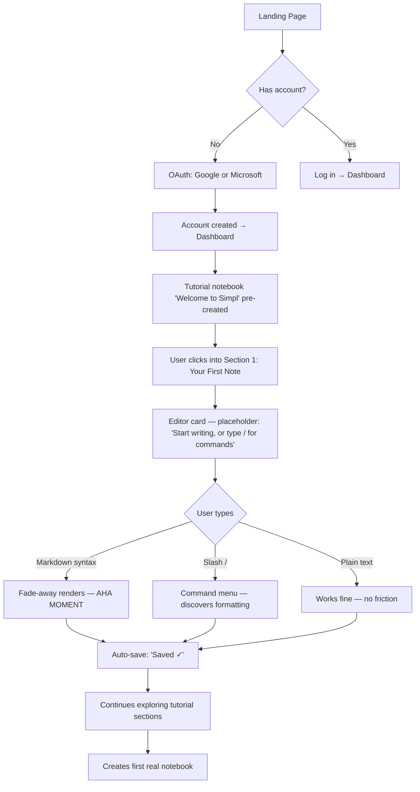
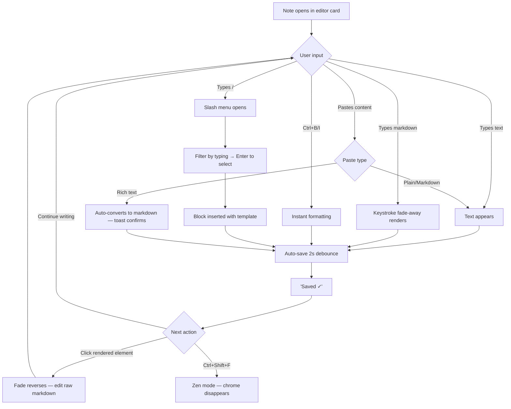
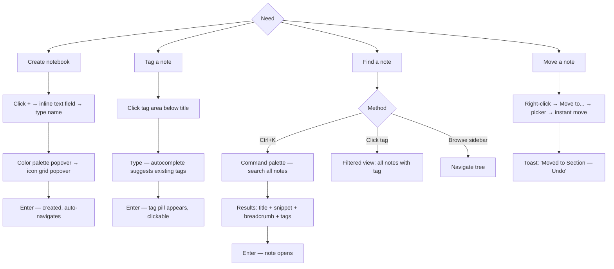
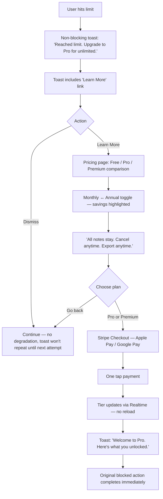

# UX Design Specification - simpl-markdown

**Author:** Komil
**Date:** 2026-04-15

---

## Executive Summary

### Project Vision

Simpl Markdown eliminates the pain of scattered notes across devices and tools. The product's identity is "simplicity as the product" — the app is distinguished not by the features it includes but by the friction it removes. The fade-away markdown editor and zero-friction cloud sync are the two core UX commitments.

### Target Users

Primary (individual, cloud-first note-takers) spanning:

- **Non-technical professionals** (Karen the secretary) — speed and ease of note-capture during fast-paced work
- **Power users** (Marcus the developer) — keyboard-first, cross-device reliability, customization
- **Casual / new-to-markdown users** (Priya the student) — discoverable entry, no intimidation
- **Intermittent users** (Sophia) — graceful re-entry after absence
- **Free-tier users approaching limits** (Dmitri) — low-friction upgrade path
- **Anonymous visitors** (Marcus the previewer) — instant value via public playground

### Key Design Challenges

1. **Fade-away editor must delight, not confuse** — novel interactions need intentional-feeling affordances
2. **First-note under 5 minutes** must work for both markdown-native and markdown-new users
3. **Four discovery mechanisms** (hierarchy, tags, search, wiki links) must feel powerful without overwhelming
4. **Free-tier limit enforcement** must feel fair (toasts, clear paths) — never punitive
5. **Responsive design** must preserve the editor experience on touch/mobile — no "editor-lite"
6. **Playground-to-authenticated transition** must feel continuous — identical editor, preserved trust

### Design Opportunities

1. Zero-chrome writing surface (Focus/Zen mode) as a brand statement
2. Empty states as teaching moments and personality showcases
3. Dual discoverability — keyboard-first for power users, visible UI for casual users
4. Notebook color/icon/cover personalization as emotional ownership
5. Toasts as respectful micro-dialogues, not interruptions

## Core User Experience

### Defining Experience

**The ONE thing:** A user types markdown into an editor and watches it transform into formatted output without ever switching modes, toggling previews, or hunting through menus. **Write → See → Done.**

Everything else — notebooks, tags, search, sync, templates — is scaffolding that supports this single interaction. If the editor isn't magical, the product fails. If the editor is magical, everything else can be merely functional.

### Platform Strategy

- **Primary:** Responsive web app — single codebase serves desktop, tablet, and mobile
- **Secondary surface:** Public `/playground` — unauthenticated demo of the core editor
- **Input modes:** Keyboard-first (optimized for power users) with full touch support (no degraded mobile experience)
- **Offline:** Graceful offline editing with auto-sync on reconnection (Phase 3 feature, not MVP)
- **Native apps deferred** — responsive web covers mobile needs for v1

### Effortless Interactions

These should require zero thought from the user:

- **Typing formatting:** `**bold**` becomes bold as you type. No button press, no mode toggle.
- **Saving:** There is no "save" action. The app saves continuously. The user never thinks about it.
- **Finding a note:** Hit `Ctrl+K`, type what you remember, get results. No browsing required.
- **Switching devices:** Log in on any device. Everything is there. Cursor position included.
- **Creating a note:** Hit `Ctrl+N`. Start typing. The note exists.
- **Formatting without knowing markdown:** Type `/`, pick from a menu. No memorization required.
- **Getting back to yesterday's work:** Open the app. Recent notes are right there on the dashboard.

### Critical Success Moments

These are the moments that make or break the user's relationship with the product:

1. **The First Fade-Away** (Minute 1) — User types `**` for the first time, sees the asterisks fade into rendered bold text. This is the "aha." If this feels glitchy or slow, trust collapses. If it feels magical, the user is hooked.

2. **The First Save Confirmation** (Minute 2) — User types a note, subtly sees "Saving..." → "Saved ✓." First sign the app is trustworthy.

3. **The Cross-Device Moment** (Session 2) — User opens the app on a second device, sees their note exactly where they left it. This is the "my problem is solved" moment that drives retention.

4. **The Search Discovery** (Week 1) — User hits `Ctrl+K` for the first time and finds something in under a second. Search becomes muscle memory — they never navigate the tree again.

5. **The Limit Hit** (Free users, Week 3-4) — User tries to create a fourth notebook. The message feels helpful, not punitive. The upgrade path is visible. If this moment feels coercive, we lose the user forever.

6. **The Return After Absence** (Months later) — User comes back. Everything is there. No re-onboarding. No lost data. Trust is preserved.

### Experience Principles

1. **Friction is the enemy.** Every click, every modal, every required decision is a tax on the user. Remove anything that isn't essential.

2. **The editor is sacred.** Nothing interrupts writing. No popups while typing. No animations that distract. No chrome that can be collapsed during flow states.

3. **Show depth on demand, never upfront.** The app has hundreds of features. The user should only see what they need right now. Power reveals itself through slash commands, keyboard shortcuts, and progressive disclosure.

4. **Never surprise the user in a bad way.** No hidden costs. No feature-shaming toasts. No dark patterns. Every interaction respects the user's intelligence and time.

5. **Delight is in the details.** Micro-interactions, empty states, confirmation toasts, theme transitions — these small moments cumulatively define how the app feels. Budget design time for them.

## Desired Emotional Response

### Primary Emotional Goals

**The dominant feeling: CALM COMPETENCE.**

Users should feel quietly capable. Not hyped. Not dazzled. Not impressed by flashy features. Just quietly, confidently in control of their thoughts, notes, and work. Simpl Markdown is the opposite of apps that shout for attention — it's the app that fades into the background so the user's thinking becomes the foreground.

**Four supporting emotional states:**

1. **Effortlessness** — "I didn't even have to think about that." The fade-away editor, auto-save, and keyboard shortcuts remove every cognitive tax.

2. **Trust** — "My stuff is safe here." Cross-device sync, version history, trash recovery, encrypted notebooks, and timely save confirmations build confidence that data is never at risk.

3. **Pride of Place** — "This is my space." Notebook colors, custom covers, theme choices, personal dashboards, and custom templates create emotional ownership.

4. **Delight in Details** — "Oh, that's nice." Small surprises — the fade-away animation, a well-crafted empty state, a well-timed toast — accumulate into affection.

### Emotional Journey Mapping

| Stage | Desired Emotion | Trigger |
|-------|----------------|---------|
| Discovery (landing, playground) | Intrigue without skepticism | Clean landing, playground demo shows editor in action |
| Signup (first 2 minutes) | Relief | One-click social login — no forms, no friction |
| First note (minutes 2-5) | Surprise → Delight | Watching markdown fade into rendered output |
| Daily use (weeks 1-3) | Flow | Writing without friction, finding notes instantly |
| Cross-device moment (session 2 on new device) | Vindication | Everything is exactly as they left it |
| Limit hit (free tier, week 3-4) | Informed, not cornered | Friendly toast, clear upgrade path, no pressure |
| Upgrade decision (if relevant) | Autonomous | User decides on their terms, not under coercion |
| Error or loss (if occurs) | Reassured | Auto-save confirms data is safe; trash offers recovery |
| Return after absence (months later) | Welcomed, not forgotten | Data intact, no forced re-onboarding, gentle "what's new" |
| Long-term use (months) | Quiet satisfaction | The app continues to fade from consciousness — just there when needed |

### Micro-Emotions

Critical for product success:

- **Confidence > Confusion** — Every interaction must confirm "I'm doing this right." No ambiguity about app state.
- **Trust > Skepticism** — The app never surprises with hidden costs, lost data, or aggressive upsells.
- **Calm > Anxiety** — No urgency messaging. No countdown timers. No streak-shaming. No "you're missing out" notifications.
- **Accomplishment > Frustration** — Tasks complete. Saves work. Searches return results. The app delivers on its promises.
- **Delight > Satisfaction** — Micro-animations, thoughtful copy, and small surprises elevate "it works" to "it's a pleasure to use."

Emotions to actively prevent:

- Overwhelm from feature density
- Shame at hitting free-tier limits
- Suspicion that the app is mining user data
- Disorientation when the editor changes state (fade-away must feel intentional, never glitchy)
- Regret after any irreversible action (everything recoverable via trash)

### Design Implications

| Emotion | Design Approach |
|---------|----------------|
| Effortlessness | Auto-save without user action; slash commands replace formatting buttons; keyboard shortcuts for everything |
| Trust | Visible "Saved ✓" confirmations; trash with restore; visible encryption lock icons; transparent privacy messaging |
| Pride of Place | Custom notebook colors/icons/covers; theme personalization; dashboard widgets user configures |
| Delight in Details | Smooth fade-away animation; thoughtful empty states with wit; toast notifications that feel human; intentional micro-copy |
| Calm | No modal interruptions; toasts that auto-dismiss; subtle onboarding nudges; respect for Do Not Track |
| Confidence | Clear state indicators (saving, saved, syncing); predictable keyboard shortcuts; consistent interaction patterns |
| Autonomous | Non-blocking limit enforcement; opt-in everything; easy account/data export; cancel-anytime billing |

### Emotional Design Principles

1. **Fade, don't flash.** Animations and transitions should feel like breathing — present but never attention-grabbing.

2. **Confirm quietly.** The app tells users what's happening through understated visual feedback — never intrusive popups.

3. **Respect attention.** Notifications compete for cognitive bandwidth. Use them sparingly, always with purpose, never for growth hacks.

4. **Feature density ≠ feature visibility.** Power lives beneath the surface (slash commands, shortcuts). Users opt into depth; depth doesn't impose itself.

5. **Failure is a feature.** Trash, undo, restore, export — the app's relationship with user data is "you can always go back."

6. **Copy has a voice.** Microcopy is warm and human without being cute. Lean human over clinical.

## UX Pattern Analysis & Inspiration

### Primary Inspiration Sources (Core Writing Loop)

**1. iA Writer (ia.net/writer) — The Philosophical Parent**

The direct ancestor of "simplicity as the product" applied to markdown. Study:
- Focus mode and typewriter mode — techniques for eliminating every visual distraction during writing
- Ruthless feature restraint — they've said "no" to features for a decade to stay simple
- Typography discipline — carefully chosen monospace-adjacent typeface, line-height, and color palette
- Syntax highlighting for parts of speech — a genuinely novel use of markdown-native rendering

**2. Craft (craft.do) — The Modern Simplicity Benchmark**

Notion-adjacent but radically calmer. Study:
- Best-in-class typography and document feel on a modern stack
- Generous whitespace and spacing discipline
- Motion restraint — animations exist but never shout
- Clean document hierarchy without block-based rigidity

**3. Bear (bear.app) — Typography and Writing Feel**

Study:
- Inline markdown rendering (closest existing analog to fade-away)
- Beautiful typography that makes writing feel good
- Tag system that's powerful but unobtrusive
- Curated theme palette, not unlimited chaos

**4. Ghost editor (ghost.org) — Markdown-First Web Writing**

Study:
- Clean markdown-first writing surface on the web
- Publishing-focused DNA aligns with our playground thesis
- Proves rich text can feel native on TipTap/ProseMirror, not clunky

### Secondary Inspiration Sources (Interaction Patterns)

**5. Notion (notion.so) — The Slash Command Paragon**

Study:
- `/` command menu as primary content insertion model (FR20, FR21)
- Searchable command menu with icons and descriptions
- Template library categorization

Avoid: block-based rigidity, performance creep on large workspaces, complex navigation hierarchy.

**6. Linear (linear.app) — The Calm Competence Standard**

Study:
- `Cmd+K` command palette as primary navigation (FR67)
- Subtle toast notifications that never interrupt (FR88-FR90)
- Fast, responsive interactions — every click feels instant
- Clean typography with excellent contrast and restraint
- Dark mode done natively, not bolted on

Note: command palettes are now table stakes, not differentiation — Linear normalized them.

### Tertiary Inspiration Sources (Adjacent Patterns)

**7. tldraw (tldraw.com) and excalidraw (excalidraw.com) — The Playground Model**

Study (replacing CodePen):
- Zero chrome — landing page *is* the canvas
- No account visible in the default view
- Conversion prompt appears only when user tries to save (moment of highest intent)
- Feature parity between logged-in and logged-out users
- No social layer, no profiles, no trending — just the tool

This is the correct model for `/playground` — deliver value first, convert only when the user asks to save.

**8. Obsidian (obsidian.md) — Power User Reference (Demoted)**

Since wiki-style linking (FR32) and backlinks (FR33) moved to Phase 3, Obsidian is now a power-user reference rather than primary inspiration. Study its wiki-link autocomplete and backlink panel when those features arrive in Phase 3.

Avoid: plugin ecosystem complexity, raw-markdown editor that shows syntax permanently, steep learning curve.

### Reference-Only Sources (Shell, Not Core)

**9. Stripe Dashboard — Pricing Page Reference Only**

Use for: pricing page layout and comparison, subscription management UX, transparent billing copy.

Do not use for: core app chrome, settings UX, or general interaction patterns. It's a dashboard; we're a writing app.

### Awareness References (International/Regional)

Worth knowing for positioning awareness, not direct adoption:

- **Cosense (formerly Scrapbox)** — Japanese, bracket-link-driven, real-time collaborative. Different paradigm valuing density over whitespace minimalism.
- **Inkdrop** — Japanese, markdown-focused, solo-developer-built. Direct competitor worth knowing cold.
- **Standard Notes** — European privacy-first, E2E encryption UX sensibility.
- **Anytype** — Polish, local-first Notion alternative. Privacy signals baked into UI.
- **Flomo** — Chinese, notes-as-stream (Luhmann's zettelkasten inspiration).
- **Joplin** — Open-source, privacy-forward, familiar to Evernote migrants.

### Voice & Copy Inspiration (Brand Voice References)

**Adopt as voice references:**

- **Basecamp / 37signals** — Gold standard for plainspoken confidence. Settings pages and error states. They never perform friendliness; they just are.
- **Stripe docs and dashboard copy** — Benchmark for technical clarity that doesn't condescend. Directly relevant for payment and pricing surfaces.
- **Linear** — Tight, competent, power-user-aware. Reference for keyboard hint copy and command palette microcopy.
- **iA Writer** — Closest tonal sibling to Simpl Markdown. Study empty states and preferences.
- **Things 3 (Cultured Code)** — Masterclass in calm confirmation copy and respectful defaults.

**Explicitly avoid as voice references:**

- **Mailchimp** — Too playful for our brand (the Freddie-era mascot voice is exactly what we don't want)
- **Intercom** — Leans hype-y in product
- **Slack** — Cutesy, loves exclamation marks

### Core Editor Design Decisions

**Fade-away trigger:** Keystroke-triggered. When the user types the closing syntax (e.g., the second `**` for bold), the markdown fades as the text renders. Creates a tight cause-and-effect loop that feels responsive.

**Rationale:** Keystroke triggers feel immediate. Time-based feel laggy. Cursor-leave feels unpredictable.

**MVP scope for fade-away:** Four syntax types only — bold, italic, headings (H1-H3), and links. Code blocks, tables, lists, and other block-level fade-away behaviors deferred to v1.1. Each syntax type requires a separate TipTap decoration plugin; shipping all of them in MVP is not feasible in 9 weeks for a solo developer.

**Cross-device sync reality:** "Real-time sync" in MVP means *"open doc on Device B within ~1s of saving on Device A via Supabase Realtime notification + refetch"*, NOT Google-Docs-style CRDT co-editing. Conflicts resolved by `updated_at` timestamp (last-write-wins).

### User Segment: "Solo User = Anyone"

The target user is broad — writer, developer, student, knowledge worker, secretary, founder. Inspiration list stays broad to serve all these segments. No segment-specific optimization in v1.

### Transferable UX Patterns

**Navigation Patterns:**
- Command palette as primary nav (Linear) — `Ctrl+K` opens searchable menu that does anything
- Collapsible sidebar tree (Notion) — scannable hierarchy with disclosure triangles
- Breadcrumbs in search results (Notion, Google Docs) — show context without requiring navigation

**Interaction Patterns:**
- Keystroke-triggered fade-away formatting (iA Writer-inspired, Bear-adjacent)
- Slash command menu for insertions (Notion)
- Non-blocking toast notifications (Linear, Gmail)
- Cmd/Ctrl+K for global search (Linear, GitHub, Figma)
- Zero-chrome playground (tldraw, excalidraw)

**Visual Patterns:**
- Restrained color palette (Linear, iA Writer)
- Typography-first hierarchy (Bear, iA Writer, Craft)
- Theme as mode, not just dark/light — light/dark in MVP, sepia deferred to v1.1
- Subtle animation (Linear, Craft, Stripe) — 150-250ms for state changes

**Empty State Patterns:**
- For writing surfaces: empty state = blinking cursor. That's the product.
- For navigation surfaces: contextual guidance (Notion, Linear) — "No results for X. Try Y"
- Humanized microcopy (Basecamp, Things 3) — written like a calm friend wrote it

### Anti-Patterns to Avoid

- ❌ **Obsidian's plugin overload** — curated features, not a platform
- ❌ **Notion's performance creep** — stay fast regardless of note count
- ❌ **Notion's block-based rigidity** — forcing a "block type" per paragraph is friction
- ❌ **Evernote's modal-heavy UX** — inline state and toasts instead
- ❌ **OneNote's non-portable formatting** — everything stays in portable markdown
- ❌ **Context-free upgrade prompts** (Dropbox, Zoom, Canva) — arbitrary timing erodes trust
- ❌ **Streak-shaming notifications** (Duolingo) — gentle streaks as feature, never as guilt
- ❌ **Forced onboarding walkthroughs** — tutorial notebook the user can ignore, not modal tours
- ❌ **Autosave ambiguity** — "Saved / Saving / Error" state must be unambiguous (Google Docs nails this)
- ❌ **Elaborate illustrated empty states on writing surfaces** — a blinking cursor is correct
- ❌ **Sync conflict modal dumps** — surface gracefully, never as blockers
- ❌ **Mobile-as-afterthought** — responsive must preserve the editor, not degrade it

### Upgrade Prompt Principle

The anti-pattern is not upgrade prompts themselves — it's *context-free or interruptive* prompts. Valid upgrade prompts:

- **Value-moment prompts** (Superhuman, Linear) — shown when the user is actively experiencing value
- **Limit-hit prompts** (our design) — shown exactly when the user tries to exceed a free tier limit
- **End-of-trial summary** — shown at trial end with concrete usage data

Invalid upgrade prompts:

- Banners on every page unrelated to user action
- Timed popups
- "You're missing out" notifications
- Feature-shaming (locking visible UI elements behind upgrade)

## Copy & Voice Guidelines

### Operational Voice Rules

The principle "warm and human without being cute" is too vague to enforce alone. These operational rules make it testable:

**Tests every piece of copy must pass:**

1. **The "said aloud" test** — Would a competent colleague say this sentence to you at a desk? If it sounds like a form letter or a product tour, rewrite.
2. **The "calm friend" test** — Would a calm, informed friend phrase it this way? Not a hype friend. Not a clinical friend.

**Forbidden register:**

- No "Oops!", "Whoops!", "Uh oh!"
- No exclamation marks except for genuine celebration (e.g., "Welcome to Pro" is fine; "Saved!" becomes "Saved")
- No "Let's..." as a pseudo-collaborative opener
- No emoji as decoration in body copy (status glyphs like ✓ in "Saved ✓" are fine — they carry information)
- No anthropomorphizing the app ("I'm having trouble..." → "Couldn't connect. Retrying in 5 seconds.")
- No self-deprecating cutesiness ("Our servers are having a bad day")
- No mascot voice

**Forbidden tropes:**

- No "just" as a softener ("Just click here" — delete every "just")
- No passive voice to dodge agency ("Your payment could not be processed" → "Your bank declined the charge")
- No generic apologies ("Sorry, something went wrong") — replace with: what happened, what to do, and whether data is safe

**Style rules:**

- **Sentence length ceiling:** Microcopy caps at ~12 words. Longer means not finished editing.
- **Verb preference:** Plain verbs over marketing verbs. "Create notebook," not "Start your journey." "Delete," not "Say goodbye to."
- **Button labels:** Use specific verbs. Destructive dialog buttons say "Delete notebook" and "Keep notebook" — never generic "OK" and "Cancel."
- **Capitalization:** Sentence case everywhere (not Title Case). Documented once, enforced via review.
- **Tense consistency:** Within any flow, pick one ("You'll see..." vs "Here is...") and stay consistent.
- **Toast copy:** Glanceable, not readable. If the user must read carefully, it should be a dialog or inline message.

### Copy Surface Inventory (Non-Exhaustive)

Surfaces that need copy standards and review:

**Notifications & Feedback:**
- Toast notifications (save, sync, errors, trash, tags)
- Inline status indicators (Saving... / Saved ✓ / Offline)
- Loading and latency states (copy shown at 400ms, 2s, 10s)
- Offline and reconnect states

**Destructive Actions:**
- Delete note, delete section, delete notebook
- Empty Trash
- Delete account (requires typing account name, not a checkbox)
- Permanent deletion confirmations

**Empty States:**
- Empty notebook / section / note / search / favorites / trash / journal day / tag view
- Writing surfaces use blinking cursor, not illustrated CTAs
- Navigation surfaces use contextual guidance

**Discovery & Onboarding:**
- Keyboard shortcut hints (hidden but discoverable)
- Tutorial notebook lesson copy
- Feature announcements ("What's New")
- Help text near complex features

**Accessibility:**
- ARIA labels for every interactive element
- Screen reader announcements for toasts
- Alt text conventions for images and Mermaid diagrams

**Formatting & Pluralization:**
- "2 minutes ago" vs "just now" vs timestamps — pick a rule
- "1 notebook" vs "2 notebooks" vs "No notebooks yet" (ICU message format or equivalent)

**Conflict & Error States:**
- Sync conflicts (not called "errors" — called "choices")
- Payment failures (name the actor, name the consequence, name the action)
- Auth errors, encryption key issues
- Dead-end states (expired links, revoked access)

**Email Copy:**
- Receipts, password resets, sign-in links, account deletion confirmations
- Do NOT inherit Stripe/Supabase default copy — rewrite to match voice

**Legal-Adjacent Copy:**
- Cookie banners, consent, privacy one-liners near inputs
- Written in human voice, not lawyer voice

### Sensitive Moments — Copy Principles

**General principle:** In sensitive moments, reduce voice, increase precision. Warmth without clarity is cruelty. Rank concerns in this order: **the user's data, the user's money, the user's time, the user's feelings.**

**Payment failures:**
- Name the actor: "Your bank declined..."
- Name the consequence: "You're still on Pro until April 30"
- Name the action: "Update card"
- Never use "failed" as the first word — it reads as the user's failure

**Sync conflicts:**
- Don't call it an error. It's a choice.
- Copy: "This note was edited on two devices. Keep both versions, or pick one."
- Always preserve both by default. Never auto-resolve silently.

**Account deletion:**
- Require typing the account name (not a checkbox)
- Tell the user exactly what gets deleted, what's irreversible, and when (immediate vs. 30-day grace)
- One confirmation, not three — respect is shown by not treating them like a child

**Encryption recovery / lost key:**
- Be plainly honest: "Without your recovery key, this data cannot be decrypted. Not by you, not by us. This is what end-to-end encryption means."
- Sugarcoating this is a breach of the E2E promise

**Data export / leaving:**
- Make it generous. "Download everything" is one click and actually works.
- The offboarding copy is what users screenshot and post.

### Copy Ownership Model

Copy review is a shipping gate. Engineers do not write final toast/error/empty-state copy. The voice will drift within a quarter without this discipline.

**Process:**
- Feature PRs with user-facing copy require copy review before merge
- A shared copy doc (or code file) contains approved microcopy, imported into components
- Ad-hoc additions flagged in code review and brought back to the copy doc

## Design System Foundation

### Design System Choice

**Tailwind CSS + Radix UI Primitives + shadcn/ui**

A "headless primitives + utility CSS" approach — not a traditional component library:

- **Tailwind CSS** — Already in the stack. Handles all styling, spacing, color, responsive design, dark mode, and theme transitions via CSS variables.
- **Radix UI Primitives** — Headless, unstyled, accessible component primitives (dialog, dropdown, tooltip, tabs, toggle, combobox, etc.). Handles keyboard navigation, focus management, ARIA attributes, and screen-reader compliance out of the box. Zero design opinions.
- **shadcn/ui** — Copy-paste components built on Radix + Tailwind. Not a dependency — you copy source code into your project and own it. Fully customizable.

### Rationale for Selection

1. **Accessibility for free.** Radix Primitives handle WCAG 2.1 AA compliance at the component level — focus traps, keyboard nav, `aria-activedescendant`, screen-reader announcements. Directly supports NFR-A1 through NFR-A5.
2. **Zero design opinion.** Unlike MUI or Ant Design, Radix/shadcn imposes no visual style. The iA-Writer-inspired typography, restrained color, and "calm competence" aesthetic are fully achievable without fighting framework defaults.
3. **Tailwind-native.** No CSS-in-JS overhead. No conflicting style systems. Themes handled via CSS custom properties and `dark:` variant.
4. **Solo developer velocity.** shadcn/ui gives 40+ production-ready components on day one. Copy, customize, own. No version lock or breaking upstream updates.
5. **Command palette built-in.** shadcn/ui includes `cmdk` component mapping directly to `Ctrl+K` global search (FR67). Saves 2-3 days of implementation.
6. **Community and ecosystem.** De facto standard for Next.js + Tailwind projects. Excellent docs. Strong community.

### Implementation Approach

**Foundation Setup (Sprint 1, Day 1-2):**

1. Initialize Tailwind with CSS custom properties for theme tokens (`--color-background`, `--color-foreground`, `--color-primary`, `--color-muted`, etc.)
2. Light/dark mode via `dark:` class and `prefers-color-scheme` media query
3. Accent color override for user-customizable colors (FR61)
4. Install Radix UI primitives as needed (dialog, dropdown-menu, popover, tooltip, tabs, toggle, scroll-area, separator)
5. Copy in shadcn/ui components: Button, Input, Dialog, DropdownMenu, Command (cmdk), Toast (sonner), Popover, Tooltip, ScrollArea, Separator, Badge, Card
6. Configure `cn()` utility for conditional class merging

**Component Development Pattern:**

- Every component is a local file in `src/components/ui/`
- Styled with Tailwind classes referencing CSS custom properties
- Accessible behavior inherited from Radix primitives
- Custom components follow the same Tailwind + Radix conventions

### Customization Strategy

**Theme System Architecture:**

```
CSS Custom Properties (globals.css)
  → Tailwind theme extension (tailwind.config.ts references CSS vars)
    → Components consume Tailwind classes (bg-background, text-foreground)
      → Theme toggle switches CSS vars via class on <html>
```

**MVP Themes:**
- Light: white background, slate-900 text, blue-600 primary accent
- Dark: slate-950 background, slate-50 text, blue-400 primary accent
- User accent color: overrides `--color-primary` only (FR61)
- Sepia: deferred to v1.1

**Custom Components (bespoke implementation):**
- TipTap editor wrapper (custom ProseMirror + Tailwind)
- Notebook sidebar tree (custom tree + Radix scroll-area)
- Slash command dropdown (TipTap Suggestion + Radix combobox)
- Notebook color/icon picker (custom picker + Radix popover)
- Notebook cover crop editor (image crop lib + Radix dialog)
- Journal calendar grid (custom or lightweight date lib)
- Dashboard widget grid (react-grid-layout or similar)

**Leveraged from shadcn/ui (not custom):**
- Buttons, inputs, forms, labels, badges
- Dialogs (settings, confirmations, destructive actions)
- Dropdown menus (context menus, notebook options)
- Command menu (`Ctrl+K` global search)
- Toast system (sonner)
- Tooltips, popovers, scroll areas
- Tabs (settings panel sections)

## 2. Core User Experience

### 2.1 Defining Experience

**"Type to see" — The Fade-Away Editor**

The defining experience is the moment where a user types `**important**` and watches the asterisks dissolve as the word becomes bold — in place, at the cursor, without switching views. This collapses the traditional two-step process (type syntax → toggle to preview) into a single continuous action.

**How users will describe this to friends:**
- "You just type and it looks right as you type"
- "It's like Google Docs but for markdown"
- "There's no preview button — the writing IS the preview"

Cloud sync and search are expected features — they don't generate word of mouth. The fade-away editor is genuinely novel. It's the thing that earns the first "oh, that's cool" — and that "oh" is the conversion moment.

### 2.2 User Mental Model

Users arrive with one of three mental models, and the editor must satisfy all of them:

1. **The "raw markdown" model** (Marcus the developer) — Expects to see `##`, `**`, `` ``` `` and type fluently. Wants to know the syntax is there, even if it fades. Needs the ability to click on rendered output and see the raw markdown. Will feel betrayed if the editor silently modifies or strips markdown.

2. **The "rich text" model** (Karen the secretary) — Expects bold to look bold, headings to look big, and never wants to see asterisks. The slash command menu is her primary formatting path. She learns markdown accidentally through the fade-away effect.

3. **The "blank page" model** (Priya the student) — Arrives with no mental model for markdown. The blinking cursor and gentle hints ("Type `/` for formatting options") are her entry. She discovers formatting through exploration, not knowledge.

**Key mental model risks:**
- Users from Obsidian may expect syntax to stay visible (a "show raw" toggle in settings mitigates this)
- Users from Notion may expect block-level selection and drag-and-drop (we don't offer this — document the gap)
- Users from OneNote may not understand why pasting rich text converts to markdown (auto-convert with a clear toast)

### 2.3 Success Criteria

1. **Speed is invisible.** Fade animation completes within 100ms of the closing keystroke. The transition feels like a natural consequence of typing, not a processing step.
2. **Formatting is discoverable without documentation.** 80%+ of new users produce at least one heading, one bold/italic phrase, and one list in their first session without consulting docs.
3. **Editing rendered content feels natural.** Clicking a bold word lands the cursor correctly within `**word**`, syntax re-appears smoothly. No hunting.
4. **Copy/paste works correctly.** Plain text stays plain. Markdown renders after typing continues. Rich text (Google Docs, email, web pages) converts to clean markdown. No artifacts.
5. **The editor never loses content.** Auto-save within 2 seconds. Tab crashes recover from SessionStorage.

### 2.4 Novel UX Patterns

**What's novel (requires education):**

The fade-away transition itself. Education strategy:
- Tutorial notebook Section 1: guided first experience typing `**bold**` and `## Heading`
- Inline hint on first use: "Markdown syntax fades as it renders. Click to edit." Shown once, dismissed forever.
- Playground as pre-education: users from `/playground` have already experienced the fade before signup.

**What's established (no education needed):**
- Slash command menu (`/`) — users know from Notion, Slack, Discord
- `Ctrl+K` for search — VS Code, Linear, GitHub, Figma
- `Ctrl+B` for bold — universal
- Sidebar tree — universal from file managers
- Toasts — universal
- Dark mode toggle — universal

**The unique combination:** Fade-away editing + slash commands + keyboard shortcuts = three formatting paths converging on the same rendered result in a unified view. No other editor offers all three paths to the same outcome.

### 2.5 Experience Mechanics

**1. Initiation:**
The user places cursor in a note and starts typing. Clean surface — no toolbar dominates. Faint placeholder: "Start writing, or type / for commands" (empty notes only).

**2. Interaction — Three Formatting Paths:**

**Path A: Typing markdown syntax (power users)**
User types `**` → characters appear briefly → user types word → user types closing `**` → on the closing keystroke, the entire span transitions: asterisks fade to opacity 0, the word gains bold styling. Duration: 100ms CSS transition. CSS only (opacity + font-weight), not a DOM restructure. ProseMirror document model stays consistent. Screen readers see final semantic content.

**Path B: Slash command menu (casual users)**
User types `/` → floating combobox appears below cursor with searchable commands → user filters by typing → Enter to apply. Menu follows Radix combobox ARIA pattern with `aria-activedescendant` and keyboard navigation.

**Path C: Keyboard shortcut (all users)**
User selects text → `Ctrl+B` → text becomes bold immediately (no fade — shortcuts are instant). Follows universal rich-text convention.

**3. Feedback:**
- Visual: formatting immediately visible. Bold is bold. Headings large. Code blocks highlighted. Mermaid rendered below code.
- Status: "Saving..." → "Saved ✓" badge in upper-right.
- Error: "Offline — changes saved locally." No red error. No modal. Calm.

**4. Completion:**
No "completion" — writing is continuous flow. User stops when they stop. Last state always saved. No "submit" or "finish" action. Exit states: navigate to another note (instant, already saved), close tab (SessionStorage recovery), leave for months (note exactly as left).

**5. Edit-After-Render:**
User clicks on rendered element → cursor lands at click position within raw markdown → fade reverses: syntax re-appears at opacity 1 → user edits normally → cursor moves away → fade re-applies. This "click to reveal, move to re-hide" loop is the editor's core secondary interaction.

## Visual Design Foundation

### Color System

Inspired by ClickUp's vibrant SaaS aesthetic, adapted for a calm writing tool. Cool blue-purple spectrum with restrained energy — modern and clean like ClickUp, but quieter and more focused.

**Light Theme:**

| Token | Value | Usage |
|-------|-------|-------|
| `--background` | `#FFFFFF` | Page background |
| `--background-subtle` | `#F8FAFC` | Sidebar, card backgrounds (slate-50) |
| `--foreground` | `#1E293B` | Primary text (slate-800) |
| `--foreground-muted` | `#64748B` | Secondary text, placeholders (slate-500) |
| `--primary` | `#7B68EE` | Primary actions, links, active states — ClickUp-inspired purple-blue |
| `--primary-hover` | `#6C5CE7` | Primary hover state |
| `--primary-foreground` | `#FFFFFF` | Text on primary backgrounds |
| `--accent` | `#49CCF9` | Secondary accent — ClickUp-inspired bright cyan |
| `--border` | `#E2E8F0` | Borders, dividers (slate-200) |
| `--border-focus` | `#7B68EE` | Focus rings — matches primary |
| `--success` | `#10B981` | Success banners, positive states (emerald-500) |
| `--warning` | `#F59E0B` | Warning banners (amber-500) |
| `--danger` | `#EF4444` | Danger banners, destructive actions (red-500) |
| `--info` | `#3B82F6` | Info banners (blue-500) |

**Dark Theme:**

| Token | Value | Usage |
|-------|-------|-------|
| `--background` | `#0F172A` | Page background (slate-900) |
| `--background-subtle` | `#1E293B` | Sidebar, card backgrounds (slate-800) |
| `--foreground` | `#F1F5F9` | Primary text (slate-100) |
| `--foreground-muted` | `#94A3B8` | Secondary text (slate-400) |
| `--primary` | `#A78BFA` | Primary actions — lighter purple for dark bg (violet-400) |
| `--primary-hover` | `#8B5CF6` | Primary hover (violet-500) |
| `--primary-foreground` | `#FFFFFF` | Text on primary backgrounds |
| `--accent` | `#67E8F9` | Secondary accent — lighter cyan (cyan-300) |
| `--border` | `#334155` | Borders, dividers (slate-700) |
| `--border-focus` | `#A78BFA` | Focus rings |
| `--success` | `#34D399` | (emerald-400) |
| `--warning` | `#FBBF24` | (amber-400) |
| `--danger` | `#F87171` | (red-400) |
| `--info` | `#60A5FA` | (blue-400) |

**User Accent Color (FR61):** Users override `--primary` from a curated palette of 12 pre-selected colors. Custom hex input deferred — curated palette ensures contrast compliance.

**Contrast Compliance:** All text/background combinations meet WCAG 2.1 AA (normal text 4.5:1, large text 3:1). Theme builder validates contrast at selection time.

### Typography System

**Primary Font: Plus Jakarta Sans** — Clean geometric sans-serif with slightly rounded terminals (approachable without being cute). Variable font for minimal file size. Strong italic variant for markdown emphasis rendering. Open source via Google Fonts.

**Type Scale (16px base):**

| Token | Size | Weight | Line Height | Usage |
|-------|------|--------|------------|-------|
| `--text-xs` | 12px | 400 | 1.5 | Timestamps, badges, meta |
| `--text-sm` | 14px | 400 | 1.5 | Secondary UI text, sidebar items |
| `--text-base` | 16px | 400 | 1.6 | Body text, editor default, notes |
| `--text-lg` | 18px | 500 | 1.5 | Section labels, emphasis |
| `--text-xl` | 20px | 600 | 1.4 | Card titles, note titles in lists |
| `--text-2xl` | 24px | 600 | 1.3 | Page headings, notebook names |
| `--text-3xl` | 30px | 700 | 1.2 | Dashboard heading, landing hero subtitle |
| `--text-4xl` | 36px | 700 | 1.1 | Landing page hero headline |

**Editor Typography:** Same font, user-configurable size (16-24px default 16px) and line-height (1.2-2.0 default 1.6) per FR65. Headings use relative em sizing (H1: 2.0em, H2: 1.5em, H3: 1.25em).

**Monospace Font: JetBrains Mono** — For code blocks and inline code. Excellent ligatures, clear character distinction (0/O, 1/l/I).

### Spacing & Layout Foundation

**Base Unit: 4px** — All spacing is a multiple of 4px (Tailwind default).

| Token | Value | Usage |
|-------|-------|-------|
| `space-1` | 4px | Tight gaps (icon-to-label) |
| `space-2` | 8px | Inner padding (buttons, inputs) |
| `space-3` | 12px | Compact sections (sidebar items) |
| `space-4` | 16px | Standard padding (cards, panels) |
| `space-6` | 24px | Section gaps, form field spacing |
| `space-8` | 32px | Major section dividers |
| `space-12` | 48px | Page-level vertical rhythm |
| `space-16` | 64px | Landing page section gaps |

**Layout Structure:**

```
┌─────────────────────────────────────────────────┐
│  Top Bar (48px)                                 │
│  Logo · Search (Ctrl+K) · Quick Journal · Theme │
├──────────┬──────────────────────────────────────┤
│ Sidebar  │  Main Content                        │
│ (260px)  │                                      │
│          │  ┌────────────────────────────────┐   │
│ Notebooks│  │  Editor / Dashboard / Settings │   │
│ Sections │  │                                │   │
│ Notes    │  │                                │   │
│ Journal  │  │                                │   │
│ Favorites│  └────────────────────────────────┘   │
│ Trash    │                                      │
│          │  ┌──────────┐ (collapsible)          │
│          │  │ Related  │                        │
│          │  │ Notes    │                        │
│          │  │ (280px)  │                        │
│          │  └──────────┘                        │
├──────────┴──────────────────────────────────────┤
│  Status Bar: "Saved ✓" · Word count · Shortcuts │
└─────────────────────────────────────────────────┘
```

**Responsive Breakpoints:**
- Desktop (1024px+): Full three-pane — sidebar (260px) + main + optional related panel (280px)
- Tablet (768-1023px): Sidebar collapsible, related panel collapsed by default
- Mobile (320-767px): Sidebar as full-screen drawer, editor full-width

**Border Radius:**

| Token | Value | Usage |
|-------|-------|-------|
| `radius-sm` | 4px | Badges, inline tags |
| `radius-md` | 8px | Buttons, inputs, cards, toasts |
| `radius-lg` | 12px | Dialogs, popovers, notebook covers |
| `radius-xl` | 16px | Dashboard widgets, major cards |
| `radius-full` | 9999px | Avatars, circular icons, pills |

**Shadow System:**

| Token | Value | Usage |
|-------|-------|-------|
| `shadow-sm` | `0 1px 2px rgba(0,0,0,0.05)` | Subtle lift (cards, sidebar) |
| `shadow-md` | `0 4px 6px rgba(0,0,0,0.07)` | Popovers, dropdowns |
| `shadow-lg` | `0 10px 15px rgba(0,0,0,0.10)` | Dialogs, command palette |
| `shadow-xl` | `0 20px 25px rgba(0,0,0,0.12)` | Toast notification stack |

Dark mode replaces shadows with subtle border highlights (`border-slate-700`).

**Animation Tokens:**

| Token | Value | Usage |
|-------|-------|-------|
| `duration-fast` | 100ms | Fade-away transitions, hover states |
| `duration-normal` | 200ms | Theme toggles, sidebar collapse, toast enter |
| `duration-slow` | 300ms | Dialog enter/exit, page transitions |
| `easing-default` | `cubic-bezier(0.4, 0, 0.2, 1)` | Standard easing |

All animations respect `prefers-reduced-motion: reduce` (duration → 0ms).

### Placeholder Logo

Text-based wordmark: **"simpl"** in Plus Jakarta Sans, weight 700, `--primary` color (#7B68EE). All lowercase. No period. Clean, minimal, memorable. Inverts to white on dark backgrounds. Top-left sidebar at 20px.

### Accessibility Considerations

- All color combinations validated against WCAG 2.1 AA contrast ratios
- Focus indicators: `--border-focus` (2px solid, 2px offset) visible on all backgrounds
- Dark mode independently tuned (not just inverted)
- Minimum font size: 12px; default body: 16px
- Line heights optimized for readability (1.5-1.6 body)
- `prefers-reduced-motion` respected for all animations
- `prefers-color-scheme` for initial theme detection
- High contrast mode via increased border weights and background differentiation

## Design Direction Decision

### Design Directions Explored

Six directions generated inspired by Ugmonk (analog craft), hm.la (architectural minimalism), Slite (gradient friendliness), Prometheus (open structure), dark-first immersive, and editorial hybrid. Evaluated against "calm competence" emotional goal, ClickUp-cool palette preference, and all-persona accessibility.

### Chosen Direction: Slite Gradient

**Defining characteristics:**

- **White sidebar** with clean borders — notebooks live in a calm, well-lit space
- **Gradient logo and accents** — purple (#7B68EE) to pink (#EF91F7) gradient for wordmark, notebook dots, and active sidebar items
- **Editor as a floating card** — white card on subtle gray background (#FAFAFA) with 16px border-radius, 1px border, gentle shadow. "Document on a desk" feeling.
- **Generous border radius** — 10-16px on cards, buttons, code blocks, banners, tags. Rounded, friendly, approachable.
- **Dark code blocks** (#1A1A2E) — contrasts with light editor, creates visual mode-shift between writing and code
- **Soft gradient active states** — transparent gradient wash (purple→pink at 10% opacity) for active sidebar items
- **Emoji sidebar icons** for Quick Access — human, not clinical
- **Dark rounded toasts** (#1A1A2E, 14px radius) — elevated, distinctive

### Design Rationale

1. Serves all personas equally — Karen sees clean writing surface, Marcus sees dark code blocks, Priya sees friendly rounded elements
2. Card-editor metaphor makes "note as document" tangible — expands to full screen in zen mode
3. Gradients add personality in exactly three places (logo, notebook dots, active state) — restraint keeps them special
4. Dark code blocks create natural "mode shift" between prose and code
5. Rounded aesthetic (10-16px) aligns with "calm competence" — modern without feeling like a toy

### Updated Color System

**Light Theme:**

| Token | Value | Usage |
|-------|-------|-------|
| `--background` | `#FAFAFA` | Page surface ("the desk") |
| `--background-card` | `#FFFFFF` | Editor card, sidebar |
| `--foreground` | `#1A1A2E` | Primary text |
| `--foreground-muted` | `#AAAAAA` | Secondary text, placeholders |
| `--primary` | `#7B68EE` | Primary actions, links |
| `--primary-gradient` | `linear-gradient(135deg, #7B68EE, #EF91F7)` | Logo, notebook dots, active states |
| `--primary-wash` | `rgba(123,104,238,0.1) → rgba(239,145,247,0.1)` | Active sidebar background |
| `--accent` | `#49CCF9` | Secondary accent (cyan) |
| `--border` | `#EEEEEE` | Card borders, sidebar border |
| `--border-subtle` | `#F0F0F0` | Inner dividers |
| `--surface-code` | `#1A1A2E` | Code blocks, Mermaid background |
| `--surface-code-text` | `#C8C8E8` | Code text |
| `--success` | `#10B981` | Success banners |
| `--warning` | `#F59E0B` | Warning banners |
| `--danger` | `#EF4444` | Danger banners |
| `--info` | `#3B82F6` | Info banners |

**Dark Theme:**

| Token | Value | Usage |
|-------|-------|-------|
| `--background` | `#0F0F18` | Page surface |
| `--background-card` | `#1A1A2E` | Editor card, sidebar |
| `--foreground` | `#E0E0E8` | Primary text |
| `--foreground-muted` | `#666680` | Secondary text |
| `--primary` | `#A78BFA` | Primary actions |
| `--primary-gradient` | `linear-gradient(135deg, #A78BFA, #F0ABFC)` | Logo, dots, active states |
| `--border` | `rgba(255,255,255,0.08)` | Card borders |
| `--surface-code` | `#000000` | Code blocks |
| `--surface-code-text` | `#888898` | Code text |

**Radius System:**

| Token | Value | Usage |
|-------|-------|-------|
| `--radius-button` | `10px` | Buttons, inputs |
| `--radius-default` | `12px` | Default elements |
| `--radius-card` | `16px` | Editor card, major containers |
| `--radius-pill` | `16px` | Tags, badges |

### Updated Layout Structure

```
┌─────────────────────────────────────────────────┐
│  Top Bar (52px) — white background              │
│  Logo · Search (⌘K) · Quick Journal · Theme     │
├──────────┬──────────────────────────────────────┤
│ Sidebar  │  Gray surface (#fafafa)              │
│ (256px)  │                                      │
│ White bg │  ┌──────────────────────────────┐    │
│          │  │  Editor Card (white, r:16px) │    │
│ Notebooks│  │  max-width: 740px            │    │
│ Sections │  │  margin: 16px                │    │
│ Notes    │  │  shadow: 0 1px 3px 0.04      │    │
│          │  │                              │    │
│ Journal  │  │  [note content here]         │    │
│ Favorites│  │                              │    │
│ Trash    │  └──────────────────────────────┘    │
│          │                                      │
├──────────┴──────────────────────────────────────┤
│  Status Bar (36px) — white background           │
│  "Saved ✓" · 312 words · 2 min · ⌘N ⌘K ⌘/     │
└─────────────────────────────────────────────────┘
```

Editor is a card with margin, border-radius, and subtle shadow on a gray surface — the key visual distinction of this direction. In zen mode, the card expands to fill the screen.

## User Journey Flows

### Flow 1: First-Time Signup & Onboarding

**Entry:** Landing page from search, blog, or playground CTA. **Goal:** Account → tutorial → first note → fade-away "aha" in under 5 minutes.



**Key decisions:** Zero form fields at signup. Dashboard never empty (tutorial pre-created). First fade-away within 60 seconds. Auto-save confirmation is the first trust signal.

**Error paths:** OAuth fails → "Couldn't connect. Try again or use another provider." Network drops → editor works offline, "Saved locally" toast.

---

### Flow 2: Core Note Editing

**Entry:** Click note from sidebar or Ctrl+N. **Goal:** Write, format, save with zero friction.



**Key decisions:** No toolbar visible by default. Slash menu follows Radix combobox ARIA pattern. Rich text paste auto-converts silently. Edit-after-render uses 100ms reverse-fade. Zen mode is one shortcut away.

**Error paths:** Auto-save fails → "Offline — saved locally" amber badge. Mermaid syntax error → inline error with line number.

---

### Flow 3: Note Organization & Discovery

**Entry:** User has 10+ notes, needs structure and findability. **Goal:** Create hierarchy, tag notes, find anything via Ctrl+K.



**Key decisions:** Inline creation (no modals). Color+icon chosen at creation time. Tag autocomplete. Ctrl+K is primary discovery. Context menu for actions (accessible by default). Every destructive action has undo toast.

---

### Flow 4: Playground to Signup Conversion

**Entry:** Anonymous user on /playground from SEO. **Goal:** Experience editor → value builds → conversion at moment of intent.

```mermaid
graph TD
    A[/playground — zero chrome] --> B[Placeholder: 'Paste your markdown here']
    B --> C[Notice: 'Nothing is saved. Content stays in your browser.']
    C --> D{User action}
    D -->|Pastes/types markdown| E[Fade-away renders live]
    D -->|Types /| F[Slash commands work fully]
    D -->|Types mermaid| G[Diagram renders live]
    E --> H[User works — edits, formats]
    F --> H
    G --> H
    H --> I{Conversion trigger}
    I -->|Ctrl+S or clicks Save| J[CTA: 'Create a free account to save across devices']
    I -->|Sees subtle top banner| K['Like this editor? Sign up to save.']
    I -->|Returns 2nd/3rd time| L['Welcome back. Your notes could be here every time.']
    J --> M{Decision}
    K --> M
    L --> M
    M -->|Sign up| N[OAuth → account → dashboard with tutorial]
    M -->|Dismiss| O[Continue — no penalty, no nag]
    O --> H
```

**Key decisions:** Playground IS the landing page — no marketing chrome. CTA at moment of highest intent (save attempt). No penalty for dismissing. No tab-close prompt. Returning visitors get warmer (not louder) CTA.

---

### Flow 5: Free-to-Paid Upgrade

**Entry:** Free user hits limit (3 notebooks / 50 notes / 500MB). **Goal:** Inform → educate → convert at user's pace.



**Key decisions:** Toast not modal. Toast doesn't repeat until next limit-hit attempt. Pricing page is transparent (no scarcity tactics). Apple Pay for one-tap payment. Instant activation via Supabase Realtime webhook. Welcome toast is factual, not celebratory.

---

### Journey Patterns (Cross-Cutting)

**Navigation:** Inline creation (no modals). Context menu for actions (Radix, accessible). Ctrl+K as universal entry.

**Feedback:** Toast for every action. Undo in destructive toasts (5 seconds). Status badge for persistence state.

**Progressive Disclosure:** Slash commands reveal depth. Shortcuts hidden by default, shown in tooltips. Tutorial teaches through doing.

**Conversion:** Value first, ask later. CTA at moment of intent. No penalty for declining.

### Flow Optimization Principles

1. Every flow reaches "success moment" within 3 actions
2. Error states are informative, not apologetic
3. Every destructive action reversible for 5 seconds via toast undo
4. No flow requires a page reload
5. Accessibility built into flows via Radix patterns, not bolted on

## Component Strategy

### Design System Components (shadcn/ui + Radix)

| Component | Source | Used In | Customization |
|-----------|--------|---------|---------------|
| Button | shadcn/ui | Everywhere | Gradient variant for primary CTA |
| Input | shadcn/ui | Search, settings, tags | 10px radius |
| Dialog | shadcn/ui + Radix | Settings, confirmations | Dark overlay, 16px radius |
| DropdownMenu | shadcn/ui + Radix | Context menus, notebook options | Slite Gradient rounded style |
| Command (cmdk) | shadcn/ui | Ctrl+K global search | Match editor card aesthetic |
| Toast (sonner) | shadcn/ui | All notifications | Dark bg (#1A1A2E), 14px radius |
| Popover | shadcn/ui + Radix | Color picker, icon picker, tags | 12px radius |
| Tooltip | shadcn/ui + Radix | Shortcut hints, icon labels | Dark bg, 8px radius, 200ms delay |
| Tabs | shadcn/ui + Radix | Settings, pricing toggle | Pill-style active |
| ScrollArea | shadcn/ui + Radix | Sidebar, note lists | Thin custom scrollbar |
| Badge | shadcn/ui | Tags, status, tier badges | Pill shape (16px radius) |
| Card | shadcn/ui | Editor, dashboard, pricing | 16px radius, subtle shadow |
| Toggle | shadcn/ui + Radix | Theme switch, settings | Primary gradient on active |

### Custom Components

#### 1. FadeAwayEditor

TipTap + ProseMirror with custom decoration plugins for keystroke-triggered fade-away rendering.

**Anatomy:** Editor card container (white, 16px radius, gray surface) → note title input (inline) → tag row (pills + add input) → content area (TipTap) → floating outline panel (collapsible).

**States:** Empty (placeholder), Writing (auto-save badge), Zen mode (full viewport), Offline (amber badge), Read-only (trashed notes).

**MVP scope:** Fade-away for bold, italic, H1-H3, links only. Other syntax renders without fade.

**A11y:** `role="textbox"`, `aria-multiline="true"`, ARIA live region for save status.

#### 2. SlashCommandMenu

Floating combobox triggered by `/` for inserting formatting and content blocks.

**Anatomy:** Floating container (Radix Popover) → search/filter input → categorized command list with icons → keyboard nav indicators.

**MVP commands:** /table, /mermaid, /code, /image, /h1-h3, /bold, /italic, /quote, /bullet-list, /numbered-list, /checklist, /divider, /success, /warning, /danger, /info.

**A11y:** Radix combobox — `role="combobox"` + `aria-activedescendant`. Arrow keys navigate, Enter selects, Esc closes.

#### 3. NotebookSidebar

Left navigation: notebook tree, journal, favorites, trash.

**Anatomy:** Logo → Notebooks (collapsible tree: notebook → sections → notes, each with color dot) → Quick Access (Journal, Favorites, Trash) → inline + buttons for creation.

**States:** Expanded/collapsed notebooks, active item (gradient wash), creating (inline input), mobile (full-screen drawer).

**A11y:** `role="tree"` with `role="treeitem"`. `aria-expanded` on collapsibles. Arrow keys navigate, Enter selects, right expands, left collapses.

#### 4. NoteTagInput

Inline tag management below note title.

**Anatomy:** Horizontal pill row (removable) → text input with autocomplete dropdown.

**A11y:** `role="listbox"` for autocomplete. Tag pills are buttons with `aria-label="Remove tag: [name]"`.

#### 5. NotebookColorIconPicker

Combined popover for notebook color + icon selection.

**Anatomy:** Two-tab popover — color dot grid (12 curated colors) + icon grid. Preview + apply.

**A11y:** `role="radiogroup"` per grid. Labels describe color names, not hex codes.

#### 6. SearchResultItem

Individual result in Ctrl+K palette.

**Anatomy:** Note title (bold) → matching snippet with highlighted term → breadcrumb (Notebook > Section) → tag pills.

#### 7. EditorStatusBar

Bottom bar: save status, word count, reading time, shortcut hints.

**Anatomy:** Left: "Saved ✓" / "Saving..." / "Offline." Center: word count + reading time. Right: ⌘N ⌘K ⌘/.

**A11y:** Save status uses `aria-live="polite"`.

#### 8. JournalCalendarGrid (Phase 2)

Monthly calendar for journal navigation.

**Anatomy:** Month/year header with arrows → 7-column day grid → dot indicators for entries → today highlighted.

**A11y:** `role="grid"` with `role="gridcell"`. Arrow key navigation. `aria-label` per cell.

#### 9. DashboardWidgetGrid (Phase 2)

Configurable home dashboard with widgets.

**Anatomy:** Grid container (react-grid-layout) → widget cards (Recent Notes, Favorites, Quick Access, Tag Cloud, Activity, Continue). Edit mode shows drag/resize handles.

**A11y:** Keyboard alternatives for drag operations. Each widget is a landmark with `aria-label`.

#### 10. PricingComparisonTable (Phase 2)

Three-tier pricing comparison.

**Anatomy:** Three columns (Free/Pro/Premium) → monthly ↔ annual toggle → feature rows with checkmarks → CTA buttons → reassurance text.

### Implementation Roadmap

**Phase 1 — MVP:** FadeAwayEditor (4 syntax types), SlashCommandMenu, NotebookSidebar, NoteTagInput, NotebookColorIconPicker, SearchResultItem, EditorStatusBar, all shadcn/ui foundation.

**Phase 2 — Growth:** JournalCalendarGrid, DashboardWidgetGrid, PricingComparisonTable, NotebookCoverCropEditor, TemplatePickerDialog, TimelineView, DiffViewer.

**Phase 3 — Expansion:** RelatedNotesPanel (AI grouping), AutoTagSuggestionBar, DuplicateDetectionAlert, EncryptionKeyDialog, ImportWizard, ExportFormatPicker.

## UX Consistency Patterns

### Button Hierarchy

| Tier | Style | Usage | Example |
|------|-------|-------|---------|
| Primary | Solid `--primary`, white text, 10px radius | One per screen — main action | "Create Notebook", "Upgrade to Pro" |
| Secondary | Transparent, 1px `--border`, foreground text | Supporting actions | "Cancel", "Learn More" |
| Ghost | No border/fill, muted text, hover bg | Tertiary/repeated | "Delete", sidebar items |

Gradient variant: marketing pages only (landing, pricing). Destructive: red text on ghost — never red-filled. Sizes: default 36px, small 28px, large 44px.

### Feedback Patterns

| Type | Mechanism | Duration | Example |
|------|-----------|----------|---------|
| Success | Toast | 3s auto | "Saved ✓", "Note restored" |
| Info | Toast | 4s auto | "Converted to markdown" |
| Warning | Toast | 5s, manual dismiss | "Offline — saved locally" |
| Error | Toast + inline if field-specific | Manual dismiss | "Bank declined. Update card." |
| Destructive undo | Toast + action button | 5s | "Moved to Trash — Undo" |
| Persistent | Inline badge (status bar) | Until state changes | "Saving..." → "Saved ✓" |
| Limit hit | Toast + link | 5s | "3-notebook limit. Upgrade." |

Toast rules: max 3 stack, dark bg (#1A1A2E), 14px radius, bottom-right, never blocks editor. `role="status"` for info, `role="alert"` for errors. Loading: skeleton placeholders, not spinners.

### Form Patterns

Inputs: 10px radius, label above (never floating), error below in red with icon. Inline creation preferred over modals for notebooks/sections/tags. Settings apply immediately with toast — no "Save" button. Destructive confirmations use specific verbs ("Delete notebook" / "Keep") — never "OK" / "Cancel."

### Navigation Patterns

Sidebar: always visible desktop (256px), full-screen drawer mobile. Top bar: fixed 52px with logo, search, journal, theme. URL-driven routing, client-side transitions, no page reloads. Keyboard: Ctrl+K (palette), Ctrl+N (new), Ctrl+P (switcher), Ctrl+\ (sidebar), Ctrl+Shift+F (zen), Esc (close overlay).

### Modal & Overlay Hierarchy

Tooltip (hover) → Popover (click) → Slash menu (/) → Command palette (Ctrl+K) → Dialog (explicit) → Drawer (mobile sidebar). Never stack overlays. All close on Esc. All trap focus. No auto-opening overlays.

### Empty States

Writing surfaces: blinking cursor + placeholder. Navigation surfaces: contextual guidance + suggested action. No illustrations. Copy follows calm-friend voice rules. Every empty screen has guidance.

### Loading & Transitions

Skeleton placeholders for content loading. Optimistic UI for user actions. 200ms transitions default, 300ms for major changes (zen mode). `prefers-reduced-motion` → 0ms. No full-page transitions — note switching is instant client-side.

### Context Menus

Right-click or three-dot icon on list items. Radix DropdownMenu (keyboard accessible). Destructive items at bottom, separated by divider, red text. Shortcut hints shown inline.

## Responsive Design & Accessibility

### Responsive Strategy

**Desktop-primary, mobile-capable.** Writing is the primary experience on desktop (keyboard, large screen, multi-pane). Mobile is fully functional for reading, quick capture, and light editing.

**Desktop (1024px+):** Full sidebar (256px) + editor card (740px max, centered on gray surface) + optional related panel. All keyboard shortcuts active.

**Tablet (768px–1023px):** Sidebar collapsed (overlay on hamburger tap). Editor card full-width minus margins. Touch targets 44px minimum.

**Mobile (320px–767px):** Sidebar as full-screen drawer. Editor card edge-to-edge (no radius, no margin). Top bar condensed to icons. Slash menu renders as bottom sheet. Tags scroll horizontally.

**Critical rule:** Editor card never exceeds 740px — preserves optimal line length (~65-80 chars at 16px).

### Breakpoint Strategy

| Breakpoint | Width | Approach |
|------------|-------|----------|
| Base | 0–767px | Mobile: full-width, drawer sidebar, condensed top bar |
| `md` | 768px+ | Tablet: overlay sidebar, wider editor, touch-optimized |
| `lg` | 1024px+ | Desktop: full layout, sidebar visible, keyboard shortcuts |
| `xl` | 1280px+ | Wide: generous margins around centered editor card |
| `2xl` | 1536px+ | Ultra-wide: extra margin, editor stays 740px |

### Responsive Component Behavior

| Component | Desktop | Tablet | Mobile |
|-----------|---------|--------|--------|
| Sidebar | Visible, collapsible | Overlay | Full-screen drawer |
| Editor card | Centered (740px) | Full-width minus margin | Edge-to-edge |
| Slash menu | Float below cursor | Float below cursor | Bottom sheet |
| Command palette | Centered dialog (600px) | 90% width | Full-screen overlay |
| Context menu | At cursor | At cursor | Bottom sheet |
| Toast | Bottom-right | Bottom-center | Bottom-center, full-width |

### Accessibility Strategy

**WCAG 2.1 Level AA** across all surfaces.

**Keyboard:** All elements reachable via Tab. Skip-to-content link. Arrow keys for trees/grids/menus. No keyboard traps. Custom shortcuts only when editor focused.

**Screen Reader:** Full ARIA patterns — tree (sidebar), combobox (slash/search), dialog (settings), live regions (save status), grid (calendar). Tested with VoiceOver + NVDA.

**Color:** 4.5:1 normal text, 3:1 large text. Focus: 2px solid primary. Never color-alone for meaning. Custom accent colors validated for contrast.

**Touch:** 44px minimum targets. No hover-only interactions. 8px minimum gap. No time-dependent gestures.

**Content:** Min 12px font, default 16px, configurable to 24px. Line height configurable 1.2-2.0. Scales to 200%. `prefers-reduced-motion`, `prefers-color-scheme`, `prefers-contrast` respected.

### Testing Strategy

**Automated (CI):** axe-core via Playwright, Lighthouse a11y (95+), ESLint jsx-a11y, contrast ratio validation.

**Manual (monthly):** VoiceOver + NVDA walkthroughs, keyboard-only navigation, tab order audit, color blindness simulation.

**User testing (pre-launch):** 1 screen reader user session, 1 keyboard-only session, low-end device test (4G Moto G4).
